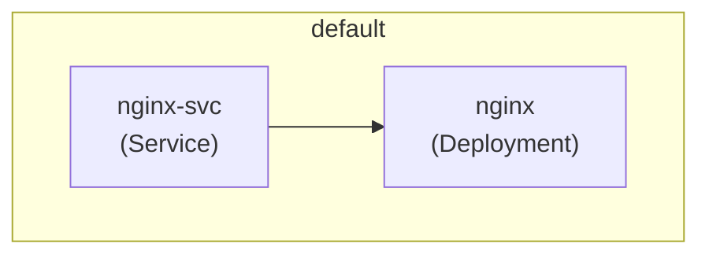

# 🧩 Koomos

[](https://raw.githubusercontent.com/Pitchouneee/koomos/main/install.sh)

**Koomos** is a simple CLI tool that analyzes Kubernetes YAML files (Kustomize, ArgoCD, Helm, etc.) and generates visual architecture diagrams using [Mermaid](https://mermaid.js.org/).

> ⚙️ Ideal for GitOps workflows, DevOps audits, or documentation automation.

---

## ✨ Features

* Parses raw Kubernetes YAML, Kustomize overlays, and ArgoCD Applications
* Generates [Mermaid](https://mermaid.js.org/) diagrams (e.g. `diag.md`)
* Groups resources by namespace with logical links (e.g. `Service` ➝ `Deployment`)
* Easy to use CLI: `koomos generate --input ./ --output diag.md`

---

## 🚀 Installation

### ▶️ With `go install` (requires Go ≥ 1.22)

```bash
go install github.com/Pitchouneee/koomos@latest
```

### 📦 With curl (no Go required)

```bash
curl -sL https://raw.githubusercontent.com/Pitchouneee/koomos/main/install.sh | bash
```

To install a specific version:

```bash
curl -sL https://raw.githubusercontent.com/Pitchouneee/koomos/main/install.sh | bash -s v0.1.0
```

---

## 🧪 Usage

```bash
koomos generate --input ./examples --output diag.md
```

Then view the `diag.md` file rendered with Mermaid in VS Code, GitLab, GitHub, etc.

---

## 📂 Example



---

## 📜 License

This project is licensed under the [MIT License](./LICENSE).  
Feel free to use, modify, and distribute it as you wish.

---

## 🙌 Contributing

PRs and ideas welcome!
